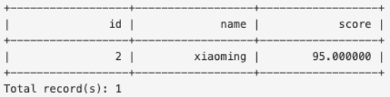

前置题目：题目九（事务控制语句）、题目四（唯一索引）

题目描述：基本功能

推荐知识点：数据异常与隔离级别、可串行化与冲突可串行化、两阶段封锁协议、多粒度封锁、死锁预防

代码框架：https://gitlab.eduxiji.net/csc-db/db2023/-/tree/main/rmdb

题目描述：
系统需要支持并发事务，参赛队伍需要实现两阶段封锁算法来保证可串行化隔离级别，对于可能出现的死锁现象，参赛队伍需要实现no-wait算法来进行死锁预防。

在完成本任务之前，参赛队伍可以首先阅读项目结构文档中并发控制的相关说明，以及代码框架中src/transaction文件夹下的代码文件。

提示：

（1）所有的共享数据都需要考虑并发访问的正确性，例如事务管理器中的txn_map和索引；

（2）由于存在范围查询，因此，参赛队伍需要考虑幻读数据异常，对于幻读数据异常，可以通过加表级锁来规避数据异常，但是为了实现更好的性能，推荐在索引中使用间隙锁。

测试示例：

本测试通过判断系统是否会出现数据异常来进行可串行化测试，包括脏写、脏读、丢失更新、不可重复读、幻读五种数据异常的测试：

例如，对脏读数据异常进行如下测试：

create table concurrency_test (id int, name char(8), score float);

insert into concurrency_test values (1, 'xiaohong', 90.0);

insert into concurrency_test values (2, 'xiaoming', 95.0);

insert into concurrency_test values (3, 'zhanghua', 88.5);

事务1:

t1a begin;

t1b update concurrency_test set score = 100.0 where id = 2;

t1c abort;

t1d select * from concurrency_test where id = 2;

事务2:

t2a begin;

t2b select * from concurrency_test where id = 2;

t2c commit;

操作序列：t1a t2a t1b t2b t1c t1d

测试输出要求：

本题目的测试通过客户端的收到的返回字符串来进行正确性判断，因此参赛队伍不能修改返回给客户端时记录的格式，也就是不能修改src/record_printer.h文件，格式化的select语句输出示例如下：

对于因为死锁预防策略而需要回滚的事务，参赛队伍需要将“abort\n”返回给客户端，除了上述select语句的输出以及事务的回滚信息之外，参赛队伍不应该将多余无用信息返回给客户端。
